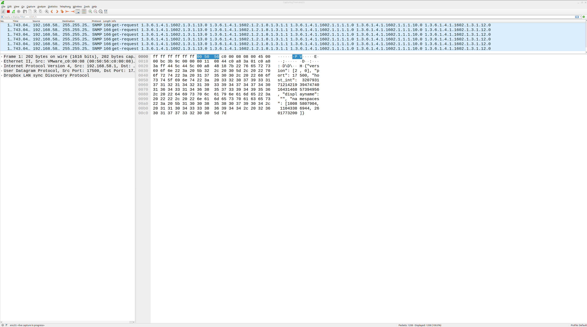
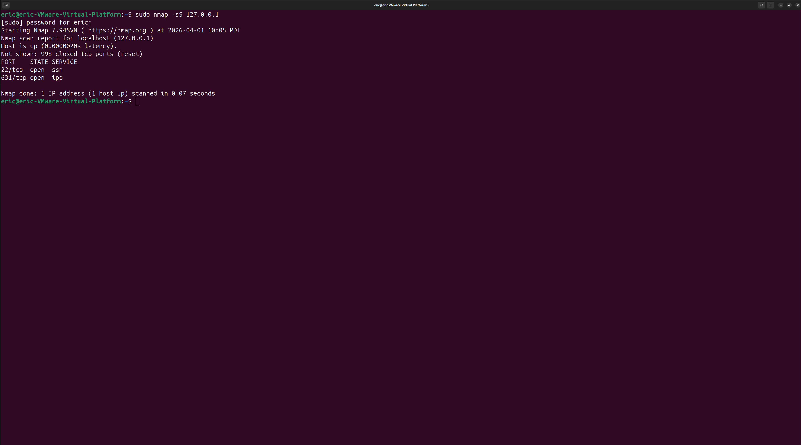
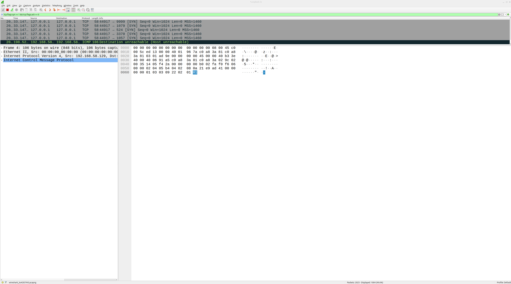

# SOC Lab 06 — Detecting Port Scanning Activity

## Table of Contents
1. [Executive Summary](#executive-summary)
2. [Lab Objectives](#lab-objectives)
3. [Environment Overview](#environment-overview)
4. [Detection Workflow](#detection-workflow)
5. [Traffic Analysis](#traffic-analysis)
6. [Detection Engineering Insights](#detection-engineering-insights)
7. [Evidence](#evidence)
8. [Conclusions](#conclusions)
9. [Next Steps](#next-steps)

---

## Executive Summary

This lab focuses on detecting port scanning activity using network traffic analysis.

Port scanning is a common reconnaissance technique used by attackers to identify open ports and services on a target system. By analyzing packet-level data, security analysts can identify scanning behavior and detect early stages of an attack.

In this lab, network traffic is captured using Wireshark while a port scan is generated using Nmap. The captured traffic is then analyzed to identify scanning patterns such as repeated connection attempts across multiple ports.

This lab demonstrates how SOC analysts detect reconnaissance activity and analyze network traffic to identify potential threats.

---

## Lab Objectives

- Generate port scanning activity using Nmap
- Capture network traffic using Wireshark
- Identify port scanning patterns in packet data
- Analyze SYN scan behavior
- Understand how reconnaissance activity appears in network traffic
- Develop foundational network detection skills

---

## Environment Overview

**Operating System:** Ubuntu Linux (Virtual Machine)

**Tools Used**

- Wireshark
- Nmap

**Network Setup**

- Localhost traffic (`127.0.0.1`)
- Single VM environment

---

## Detection Workflow

### 1. Start Packet Capture in Wireshark

Wireshark is used to capture live network traffic for analysis.  
Security analysts rely on packet capture tools to observe real-time activity and detect suspicious behavior.

Open Wireshark and select the appropriate active network interface.

For localhost traffic generated by scanning `127.0.0.1`, the correct capture interface is the **loopback interface (`lo`)**.

Start capturing traffic to begin monitoring network activity.

---

### 2. Generate Port Scanning Activity with Nmap

Port scanning is commonly used during the reconnaissance phase of an attack to identify open ports and exposed services on a target system.

To simulate scanning behavior, a SYN scan was performed against the local host using Nmap.

**Command:**

```bash
sudo nmap -sS 127.0.0.1
```

**Explanation:**

- `sudo` provides the elevated privileges required for a SYN scan
- `nmap` is a network scanning tool used to identify open ports and services
- `-sS` performs a TCP SYN scan
- `127.0.0.1` targets the local machine (localhost)

This scan generated reconnaissance traffic that was captured and analyzed in Wireshark.

---

### 3. Filter SYN Packets in Wireshark

To isolate the port scanning activity, a display filter was applied in Wireshark to identify TCP SYN packets.

**Wireshark Filter:**

```text
tcp.flags.syn == 1 && tcp.flags.ack == 0
```

**Explanation:**

- `tcp.flags.syn == 1` identifies packets with the SYN flag set
- `tcp.flags.ack == 0` excludes packets that are part of established connections
- This filter isolates initial connection attempts commonly seen during SYN scans

The filtered traffic revealed repeated SYN packets sent to multiple destination ports, which is consistent with reconnaissance behavior such as port scanning.

---

## Traffic Analysis

The packet capture revealed clear indicators of port scanning activity.

Using the Wireshark filter `tcp.flags.syn == 1 && tcp.flags.ack == 0`, multiple TCP SYN packets were identified targeting `127.0.0.1`. These packets were sent rapidly to different destination ports, which is a common pattern associated with SYN scanning behavior.

The observed behavior is consistent with TCP SYN scanning, a technique commonly used to identify exposed services without completing full TCP handshakes.

The Nmap SYN scan generated initial connection attempts without completing the full TCP three-way handshake. This behavior is often used during reconnaissance because it is faster and can be less noisy than full connection scans.

The scan successfully identified listening services on the local host, including SSH on port `22` and IPP on port `631`. These results demonstrate how attackers can enumerate exposed services during the early stages of an intrusion.

From a SOC perspective, this type of traffic is important because repeated SYN packets across multiple ports can indicate hostile reconnaissance activity that may precede exploitation attempts.

---

## Detection Engineering Insights

Port scanning activity can often be detected by monitoring for repeated connection attempts across multiple ports within a short time period.

In this lab, the SYN scan generated multiple TCP SYN packets targeting different destination ports on the same host. This pattern is commonly associated with reconnaissance and is often one of the earliest indicators of attacker activity.

Security teams can build detections for this behavior by monitoring for:

- Multiple SYN packets from a single source IP
- Connection attempts to many destination ports in a short time window
- Repeated scans against the same host or subnet

These detection opportunities can be implemented in intrusion detection systems (IDS), SIEM platforms, firewalls, or endpoint monitoring tools.

Understanding how reconnaissance appears in packet captures helps analysts build stronger detections and investigate suspicious network behavior more effectively.

---

## Evidence

All screenshots are stored in the `/screenshots` directory:

- `capture-start.png` — Wireshark capturing live traffic prior to scan analysis
- `nmap-syn-scan.png` — Nmap SYN scan results in terminal
- `syn-scan-filtered.png` — Wireshark filter showing SYN scan traffic

These screenshots provide evidence of the reconnaissance activity generated and analyzed during this lab.

### 1. Capture Started


### 2. Nmap SYN Scan Results


### 3. Filtered SYN Traffic in Wireshark


---

## Conclusions

This lab demonstrated how port scanning activity can be generated, captured, and analyzed using Nmap and Wireshark.

By performing a SYN scan against the local system, we were able to observe reconnaissance traffic at the packet level and identify the scanning behavior using a targeted Wireshark filter. The scan revealed exposed services such as SSH and IPP, illustrating how attackers enumerate systems before attempting exploitation.

Understanding how to detect and analyze reconnaissance traffic is an important foundational skill for SOC analysts, as port scanning is often one of the earliest signs of malicious activity in a network environment.

---

## Next Steps

To continue developing SOC investigation and detection skills:

- **SOC Lab 07 — Suspicious DNS Traffic Analysis**
- Capture DNS queries in Wireshark
- Identify common DNS request and response patterns
- Analyze suspicious or unusual DNS behavior

This progression expands from reconnaissance detection into protocol-level traffic analysis.
